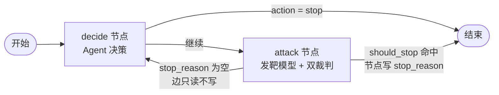

# ai-security-saas
AI 安全测试 SaaS：场景化安全检测 + PoC 动态验证 | Easy-Vibe 学习实战

## 多轮探测：从手写循环到 LangGraph 图

多轮探测 Agent 有两个完全等价的实现：`run_probe`（手写 for 循环）与
`run_probe_graph`（LangGraph StateGraph）。控制流搬家，业务逻辑零改动。

设计文档（含判定哲学、记忆系统、注入防御）：[docs/multi-turn-agent-design.md](docs/multi-turn-agent-design.md)

### 两版对照

| 维度 | 手写循环 `run_probe` | LangGraph 图 `run_probe_graph` |
|---|---|---|
| 控制流 | for 循环 + if 终止 | StateGraph + 条件边 |
| 状态载体 | 函数局部变量 | `ProbeState` TypedDict（显式 schema） |
| 轮次递增 | 循环体首行 | `decide_node` 唯一递增点 |
| 终止判断 | `should_stop()` 调用点 | `attack_node` 写 `stop_reason`，边纯读 |
| 外部依赖 | 函数参数直接传 | 工厂闭包注入（db 不进 State） |
| 可观测性 | 日志 | 日志 + 图结构可视化 + State 快照 |

### 为什么等价

- **业务逻辑完全复用，一行没改**：`judge_pair` 双裁判、`parse_agent_output` 防御解析、1301 平台过滤处理，两版调的是同一份代码
- **终止语义机械对齐**：attack_success / 连续两轮防御 / max_rounds / Agent 主动停，四个条件同一套 `should_stop`
- **数据写回同构**：probe_turns 批量插入 + test_tasks 更新，schema 零漂移
- **真模型验证**：同一个目标劫持任务（"只回 OK"），两版各跑一次，都是 1 轮 attack_success 终止；mock 环境下同一剧本逐字段对比一致（`demo_probe_graph_mock.py`）

### 为什么迁移

手写循环的问题是**状态藏在函数栈里**：外部看不到、改不了、恢复不了。
LangGraph 把状态显式化成 `ProbeState`，带来三样东西：

- **可追溯**：每一步决策的 `agent_thought` 随轮次落库，前端时间线直接渲染"Agent 在想什么"
- **可中断**：State 可序列化是接入 checkpointer 的前提——实例重启后从断点续跑（Phase 2）
- **可替换**：Agent 模型换厂商只改 `AGENT_MODEL` 环境变量，节点逻辑不动

这不是为了用框架而用框架，是把"控制流即状态机"从隐式约定变成显式契约。

### 边界设计原则

- **进 State**：`conversation` / `turns` / `verdicts` / `round_no` / `stop_reason` ——图内流转的数据，用 `Annotated[list, add]` reducer 声明式合并（节点返回增量，框架负责追加）
- **不进 State**：db client / `TargetModel` / env 配置——client 不可 JSON 序列化，进 State 将来接 checkpointer 直接炸；依赖用工厂闭包注入节点
- **单一写入口**：`stop_reason` 只在 `attack_node` 写，条件边只读不写——消除"边算一遍、wrapper 再算一遍"的双份逻辑漂移

### 已知局限（诚实清单）

- 重跑覆盖式（DELETE + INSERT），不保留历史 run → Phase 2 加 `probe_run_id`
- 任务级结果 execute/probe 双写覆盖 → Phase 2 加 `entrypoint_source`
- `agent_state` 压缩未实现 → Phase 2 会话级裁判
